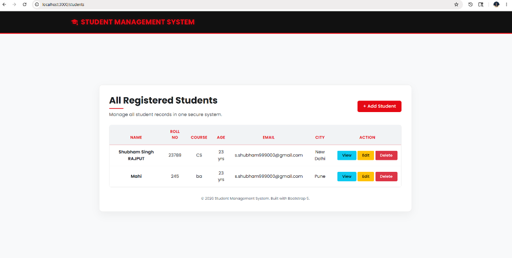
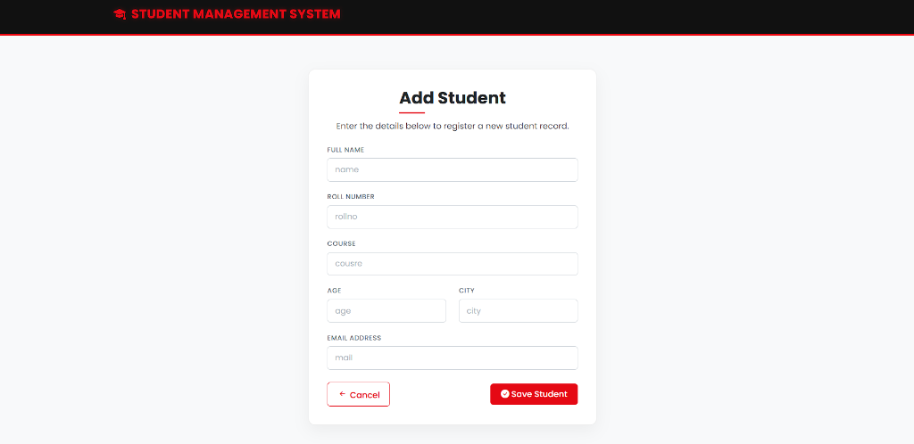
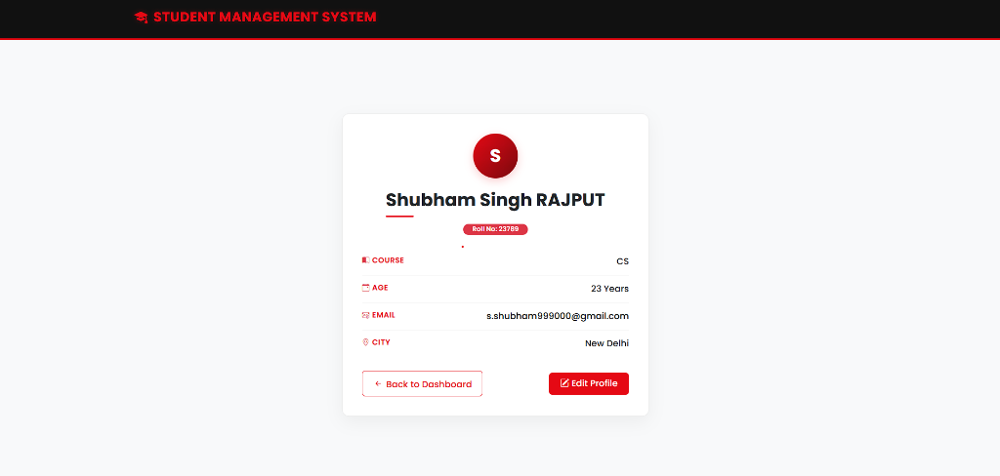

# Student Management System

A beautiful, fully functional **Student Management System** built using the Model-View-Controller (MVC) architecture with Node.js, Express, MongoDB, and EJS template engine.

---

## 🚀 Key Features

* **Dashboard**: Clean table interface showing all registered students at a glance.
* **Student Registry**: Easily add new student records with validation (Name, Roll No, Course, Age, City, and Email).
* **Detailed Profiles**: Rich view of individual student details.
* **Update Records**: Edit existing student records instantly.
* **Remove Records**: Safe deletion of student profiles from the database.

---

## 🛠️ Technology Stack

* **Backend**: Node.js & Express.js
* **Database**: MongoDB & Mongoose ODM
* **Frontend**: EJS (Embedded JavaScript), custom styles (Bootstrap 5 based design)
* **Process Manager**: Nodemon

---

## 📸 Output & UI Screenshots

Below are screenshots demonstrating the application's user interface and core functionality:

### 1. Dashboard (All Registered Students)
Features a clean registry table with action buttons to View, Edit, or Delete student records.


---

### 2. Add New Student Form
Clean, responsive input form for registering a new student into the system database.


---

### 3. Student Profile View
A beautifully organized card layout showing all details of a selected student record.


---

## ⚙️ Installation & Setup

Follow these steps to run the project locally:

### Prerequisites
Make sure you have [Node.js](https://nodejs.org/) and [MongoDB](https://www.mongodb.com/) installed on your machine.

### Steps
1. **Clone the Repository:**
   ```bash
   git clone https://github.com/ssr4king/Assginment11.git
   cd Assginment11
   ```

2. **Install Dependencies:**
   ```bash
   npm install
   ```

3. **Configure Environment Variables:**
   Create a `.env` file in the root directory and add your MongoDB connection string and server port:
   ```env
   PORT=3000
   MONGO_URI=mongodb://127.0.0.1:27017/studentDB
   ```

4. **Start the Server:**
   Using npm start (runs nodemon):
   ```bash
   npm start
   ```
   Or using node:
   ```bash
   node app.js
   ```

5. **Access the App:**
   Open [http://localhost:3000](http://localhost:3000) in your web browser.
